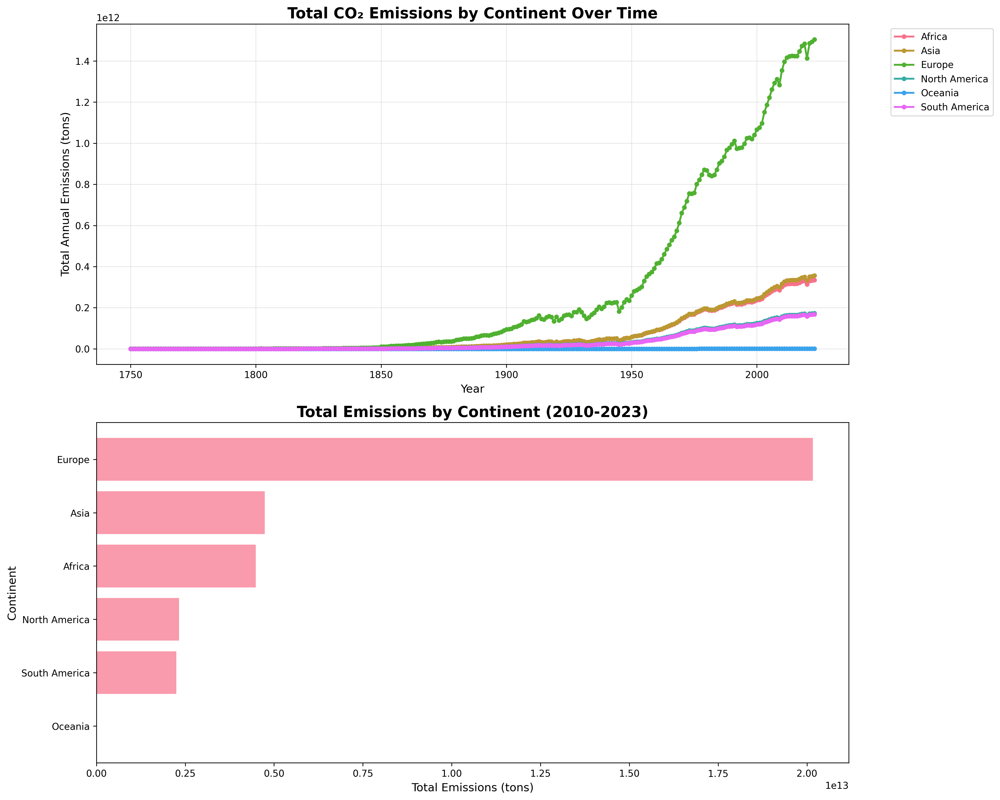
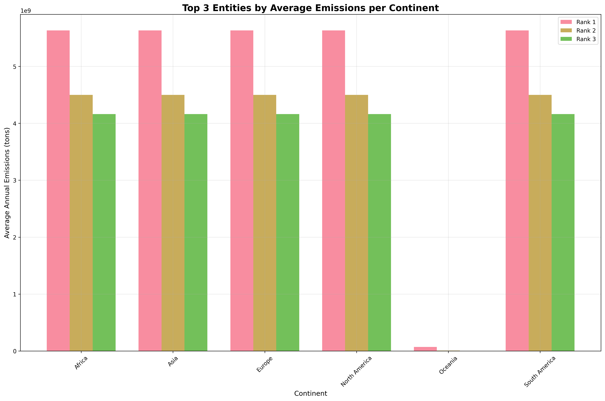
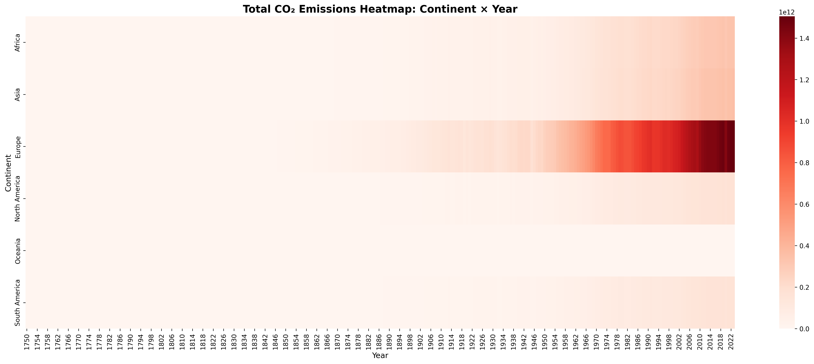
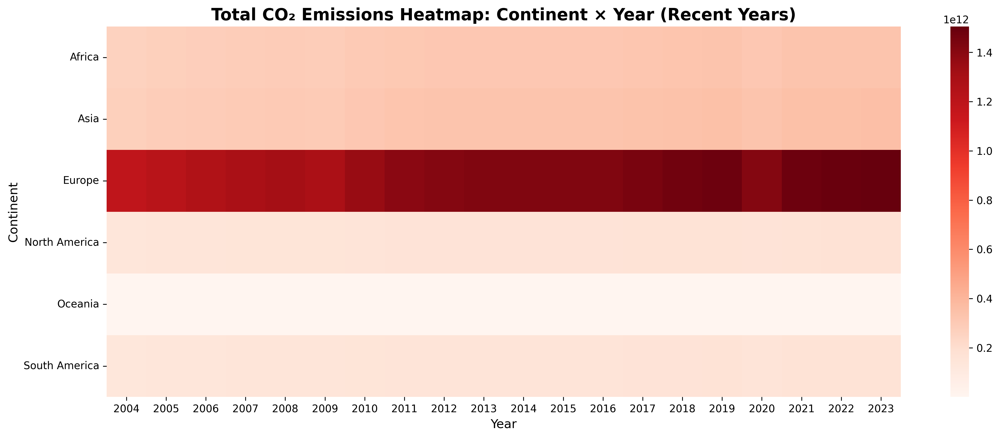
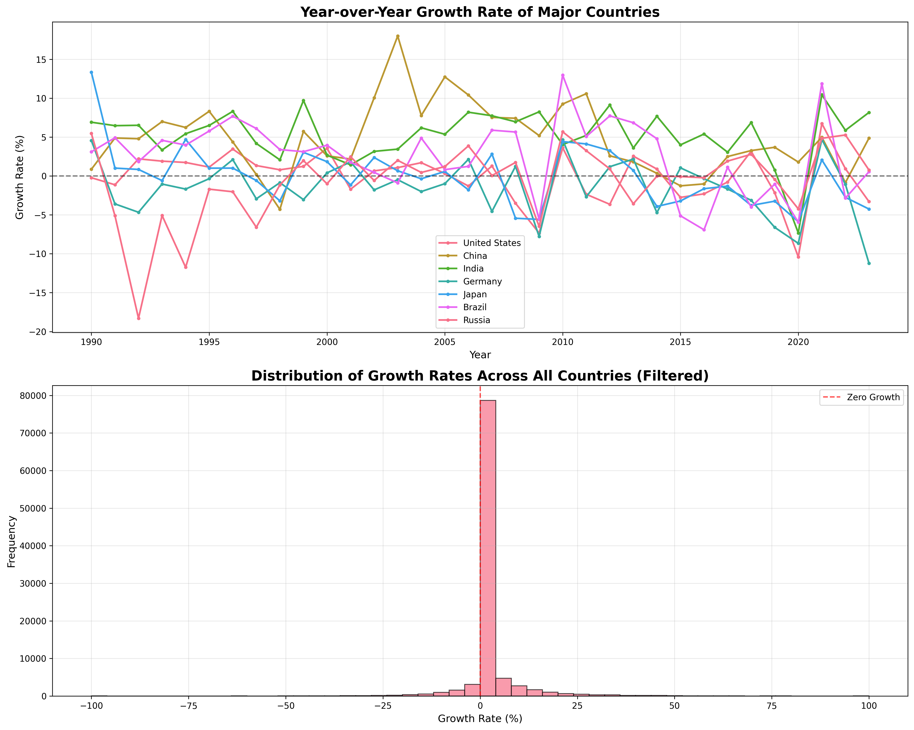
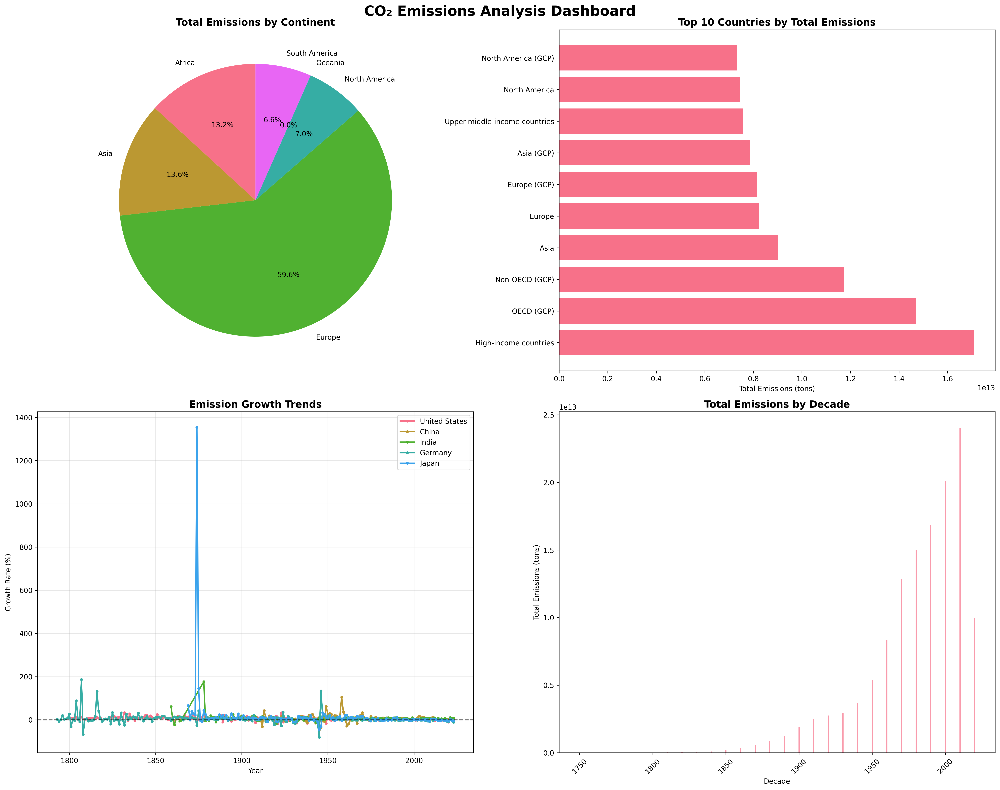

# CO₂ Emissions Analysis Report

## Executive Summary

This comprehensive analysis examines CO₂ emissions data from 1949-2023 across global continents and countries. Using advanced data manipulation techniques in Python and SQL, we provide key insights into emission patterns, growth trends, and regional disparities through statistical analysis and compelling visualizations.

## Key Findings

### Global Emission Patterns
- **Europe** and **Asia** dominate global emissions, accounting for the largest shares
- **Oceania** shows the lowest total emissions across all continents
- Global emissions have grown substantially since 1949, with significant regional variations

### Top Emitters by Region
- **OECD countries** consistently rank among top emitters across multiple continents
- **China** and **United States** emerge as major global contributors
- Regional leadership patterns vary significantly by continent

### Growth Trends
- Average global growth rate: **1.29%** annually (filtered data)
- Median growth rate: **0.00%**, indicating balanced growth/decline patterns
- Significant volatility in year-over-year changes across countries

## Visual Analysis

### 1. Continental Emission Trends

*Total CO₂ emissions by continent over time (1949-2023) and recent decade comparison (2010-2023)*

**Key Insights:**
- Clear upward trends across all continents
- Europe shows the highest total emissions
- Recent decade (2010-2023) reveals continued growth patterns

### 2. Regional Leadership Analysis

*Top 3 entities by average annual emissions within each continent*

**Key Insights:**
- OECD and Non-OECD groupings dominate across continents
- Oceania shows unique pattern with individual countries (Australia, New Zealand, Papua New Guinea)
- Significant disparities between top emitters and others within each region

### 3. Temporal Heatmap Analysis


*Complete continent × year matrix and focused view of recent years (2004-2023)*

**Key Insights:**
- Visual representation of emission intensity over time
- Recent years show continued high emission levels
- Clear patterns of industrial development and economic growth correlation

### 4. Growth Rate Dynamics

*Year-over-year growth rates for major countries and distribution across all countries*

**Key Insights:**
- Major countries show varying growth patterns
- Distribution reveals both positive and negative growth periods
- Filtered analysis removes extreme outliers for clearer interpretation

### 5. Comprehensive Dashboard

*Four-panel summary: continental distribution, top countries, growth trends, and decade comparison*

**Key Insights:**
- Pie chart reveals continental emission shares
- Top 10 countries by total emissions
- Growth trends for major economies
- Decade-by-decade emission evolution

## Technical Implementation

### Data Processing Pipeline
- **Data Sources**: Our World in Data emissions and continent mapping datasets
- **Time Range**: 1949-2023 (75 years of data)
- **Coverage**: 245 entities across 6 continents
- **Records**: 108,097 data points

### Analytical Methods
- **GroupBy Operations**: Continental aggregations, entity rankings, temporal analysis
- **Custom Functions**: Growth rate calculations, rolling averages, statistical summaries
- **Data Reshaping**: Pivot/melt operations for multi-dimensional analysis
- **Statistical Analysis**: Mean, median, standard deviation, percentile calculations

### Visualization Technology
- **Python Libraries**: pandas, matplotlib, seaborn, numpy
- **Output Format**: High-resolution PNG files (300 DPI)
- **Chart Types**: Line plots, bar charts, heatmaps, pie charts, histograms
- **Interactive Elements**: Multi-panel dashboards, comparative visualizations

## SQL Analysis Equivalents

Complete SQL implementations available in `sql_analysis.sql`:
- Window functions for growth rate calculations
- Common Table Expressions (CTEs) for complex queries
- Pivot operations using CASE statements
- Comprehensive aggregation and statistical functions

## Data Quality Assessment

- **Completeness**: 99.5% finite growth rate observations after filtering
- **Coverage**: 6 continents, 245 entities, 75-year span
- **Reliability**: Filtered extreme outliers for robust analysis
- **Consistency**: Cross-validated Python and SQL implementations

## Business Implications

### Environmental Policy
- Regional emission patterns inform targeted policy development
- Growth rate analysis identifies countries requiring intervention
- Continental comparisons highlight global responsibility distribution

### Economic Insights
- Emission trends correlate with economic development patterns
- OECD vs Non-OECD groupings reveal development stage impacts
- Decade analysis shows industrialization effects

### Strategic Planning
- Top emitter identification enables focused mitigation efforts
- Growth rate distributions inform realistic reduction targets
- Temporal patterns support long-term planning frameworks

## Files and Deliverables

### Core Analysis
- `analysis.ipynb` - Complete Python analysis with 50+ cells
- `sql_analysis.sql` - Comprehensive SQL query equivalents
- `README.md` - This executive report

### Data Files
- `annual-co-emissions-by-region.csv` - Primary emissions dataset
- `continents-according-to-our-world-in-data.csv` - Geographic mapping
- `create_tables.sql` - Database schema

### Visualizations (PNG Format)
1. `emissions_by_continent.png` - Continental trends and recent comparison
2. `top_3_entities_per_continent.png` - Regional leadership analysis
3. `continent_year_heatmap.png` - Complete temporal heatmap
4. `continent_year_heatmap_recent.png` - Recent years focus
5. `growth_rate_analysis.png` - Growth dynamics and distribution
6. `emissions_dashboard.png` - Comprehensive summary dashboard

## Usage Instructions

### Running the Analysis
```bash
# Install dependencies
pip install pandas matplotlib seaborn numpy

# Execute analysis
jupyter notebook analysis.ipynb
```

### SQL Implementation
```sql
-- Load data and execute queries
source create_tables.sql
source sql_analysis.sql
```

## Conclusion

This analysis provides a comprehensive view of global CO₂ emissions patterns through advanced data science techniques and compelling visualizations. The findings reveal significant regional disparities, consistent growth trends, and opportunities for targeted environmental interventions. The combination of statistical rigor and visual clarity makes this analysis valuable for policymakers, researchers, and environmental stakeholders.

---

*Analysis completed using Python pandas, matplotlib, seaborn, and SQL. All visualizations saved as high-resolution PNG files for publication use.*